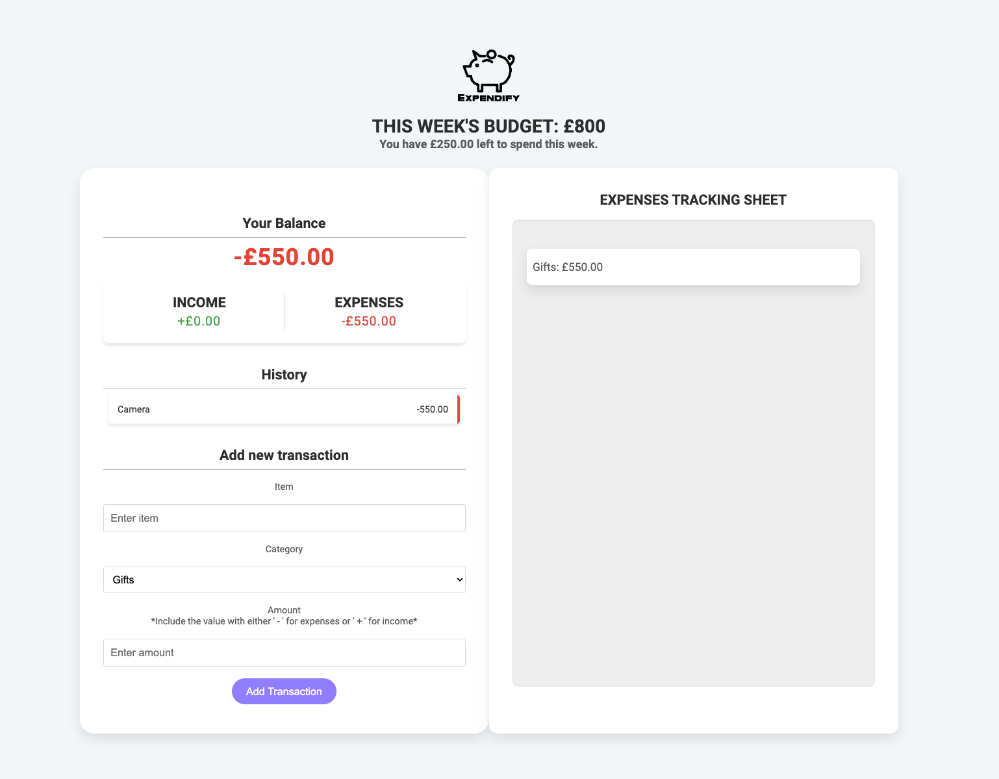
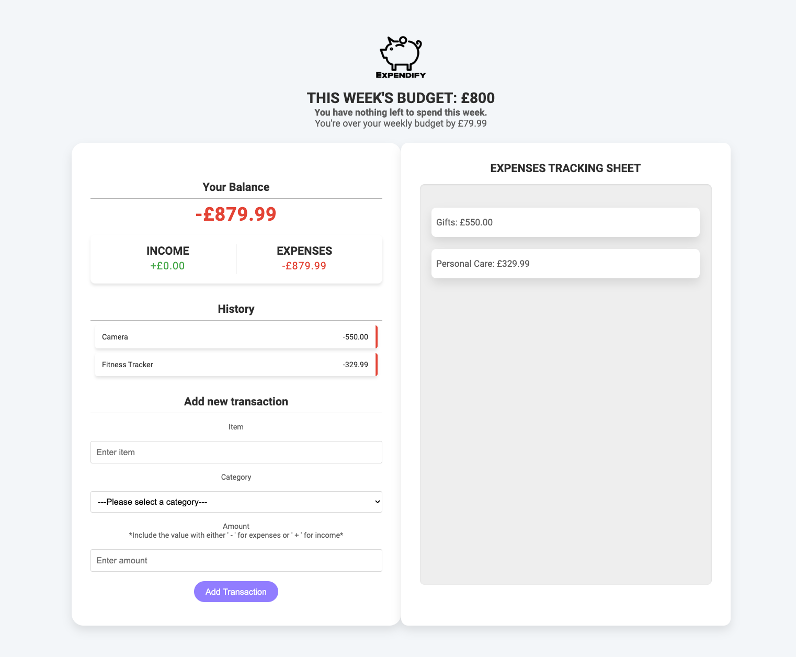

# Expendify Finance Tracker

## Description

Expendify Finance Tracker simplifies personal finance management by enabling users to effortlessly track income, expenses, and overall financial health. It facilitates setting weekly budget limits, receiving alerts upon exceeding them, and providing insights into remaining funds. This tool empowers users to make informed financial decisions and adjust spending habits by categorising transactions, thereby understanding and optimising their expenditures effectively.

**Motivation:**
The motivations for building Expendify Finance Tracker stem from addressing the fundamental challenges individuals face in managing personal finances effectively. By providing a user-friendly platform to track income and expenses, Expendify aims to empower users with the tools needed to set and monitor weekly budgets, receive alerts for overspending, and gain insights into spending patterns. This application seeks to facilitate informed financial decision-making and promote better financial habits and awareness through clear transaction categorisation and analysis.

**Problem Solved:**
Expendify addresses the need for an intuitive and effective tool to manage personal finances. It helps users track their income and expenses, set budget limits, receive alerts for overspending, and gain insights into their spending habits, leading to better financial decisions.

**Learnings:**
Developing Expendify provided valuable insights into:

- Performing complex mathematical operations using JavaScript for financial calculations.
- Manipulating the DOM through event handlers to create a dynamic and responsive user experience.
- Categorising transactions to provide clear and actionable financial insights.

## Features

- Track income and expenses easily.
- Set and monitor weekly budget limits.
- Receive alerts for overspending.
- Gain insights into spending patterns through transaction categorisation.
- User-friendly interface for effective financial management.

## Demo

#### Setting the budget for the current week


This resets every week so an input for the week's budget is required.

#### Adding transactions


This calculates the total per product category and the total of transactions added.

#### Adding transactions


The app alerts you if you have gone over the budget and how much by.

## Installation

To install and set up Expendify Finance Tracker locally, follow these steps:

1. **Clone the repository:**
   ```bash
   git clone https://github.com/yourusername/expendify-finance-tracker.git
   ```
2. **Navigate to the project directory:**
   ```bash
   cd expendify-finance-tracker
   ```
3. **Open the `index.html` file in your browser:**
   - You can open it directly by double-clicking the file or using your IDE's live server extension.

## Usage

To use Expendify, follow these steps:

1. **Launch the Application:**

   - Follow the installation instructions to open the application in your browser.

2. **Set Budget Limits:**

   - Set weekly budget limits to monitor and control your spending.

3. **Track Income and Expenses:**

   - Input your income and expenses to keep track of your financial transactions.

4. **Receive Alerts:**

   - Get alerts when you exceed your budget limits.

5. **Gain Insights:**
   - Categorise your transactions to understand your spending patterns and make informed financial decisions.

## License

This project is licensed under the MIT License. For more details, refer to the [LICENSE](LICENSE) file.

## How to Contribute

Contributions are welcome! To contribute:

1. Fork the repository.
2. Create a new branch: `git checkout -b feature/your-feature`
3. Commit your changes: `git commit -m 'Add some feature
